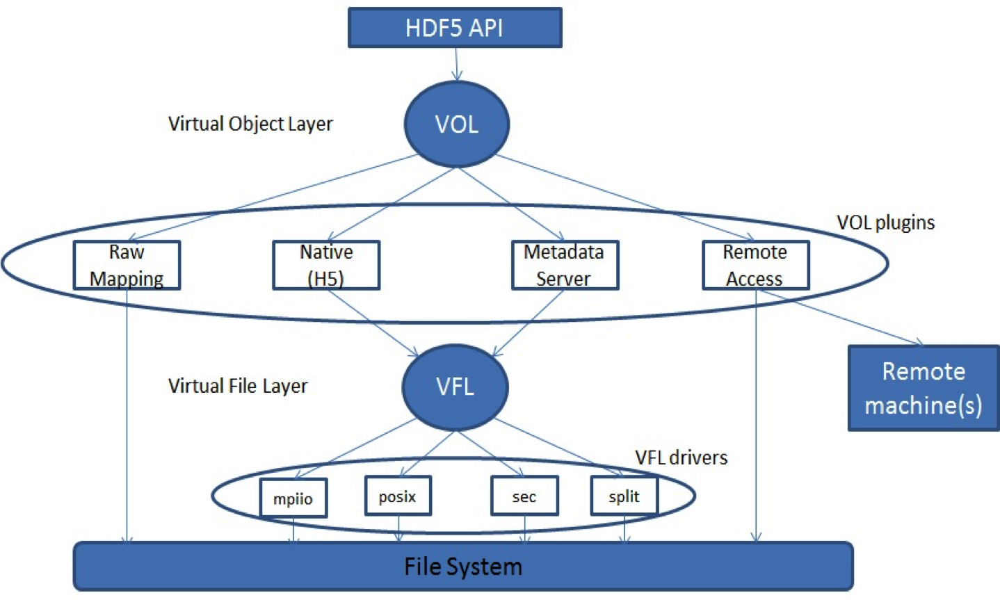
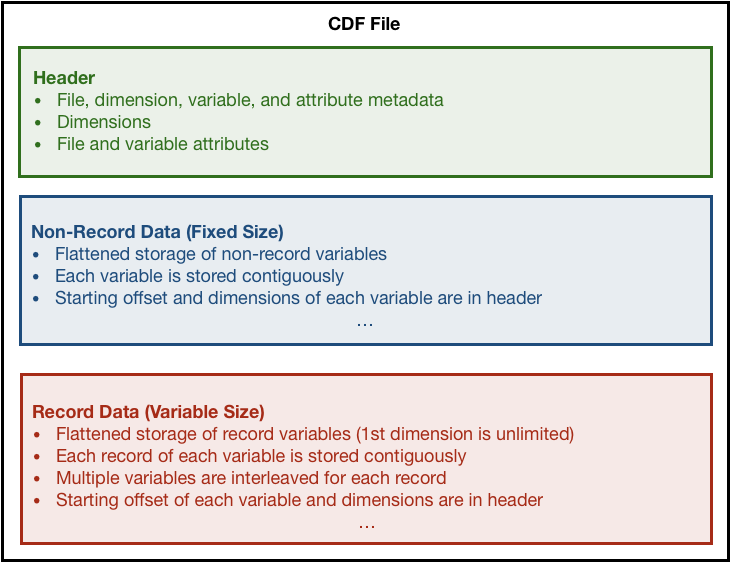
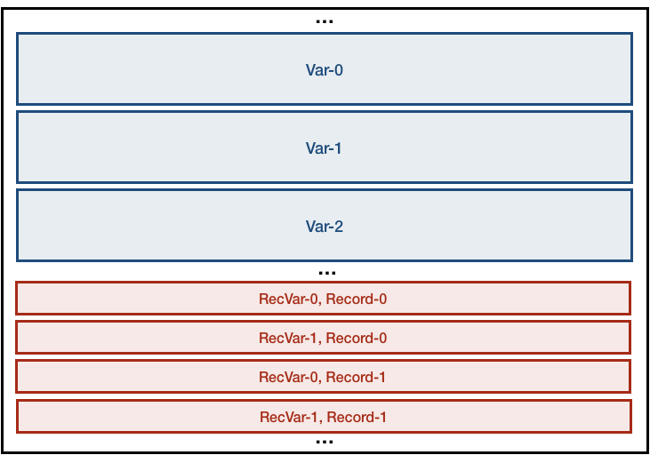
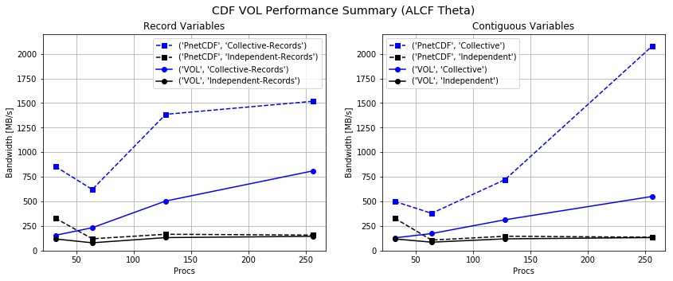

# HDF5 VOL Connector for CDF Files (CDFVL)


>**Richard Zamora, Venkatram Vishwanath & Paul Coffman**
>
>*Argonne National Laboratory*
>
>April 18th 2019


--

### Abstract

*The HDF5 technology suite offers a rich data model and flexible API for high-performance I/O.  The library interface can be used to greatly simplify the task of performing parallel I/O on large multi-dimensional arrays.  For example, hyper-slab selections make it relatively straightforward to access non-contiguous data in parallel.  Since the API is particularly well-suited for multi-dimensional data, many of it's features are also well-suited for accessing data stored in the array-based [Common Data Format (CDF)](https://cdf.gsfc.nasa.gov/) [1], which is popular in the climate-modeling community.  For this work, we have implemented a new Virtual Object Layer (VOL) connector, enabling HDF5 to read files written by CDF-based libraries, such as [PnetCDF](http://cucis.ece.northwestern.edu/projects/PnetCDF/) [2]. The CDF VOL (CDFVL) prototype allows users to read data from CDF-formatted files, without the need for additional CDF-based libraries,  using the HDF5 API.  In this document, we will discuss the details and performance of the CDFVL connector prototype.*

--

### Introduction

The [Common Data Format (CDF)](https://cdf.gsfc.nasa.gov/) [1] is a self-describing data format for the storage of both scalar and multidimensional data.  Like HDF5 [4], CDF aims to provide users with both performance and inter-platform portability. [Parallel netCDF (PnetCDF)](http://cucis.ece.northwestern.edu/projects/PnetCDF/) [2] is a parallel I/O library for accessing files stored in CDF-1, 2, and 5 formats.  It was originally introduced in 2003 as an alternative to the existing [Network Common Data Form (NetCDF)](https://www.unidata.ucar.edu/software/netcdf/) library from Unidata [3], which only allowed users to read and write CDF-formatted data in serial at the time.  Since the introduction of versions 4.0 and 4.1 of Unidata's library, netCDF has supported parallel I/O through both HDF5 and PnetCDF backends, respectively. This means that netCDF-4 is able to read and write files in either HDF5 or CDF format.

The goal of this work is to enable read-only interoperability between the HDF5 library and CDF-formatted data.  To this end, we have implemented a Virtual Object Layer (VOL) connector, allowing user applications to read CDF data using the HDF5 API.  In this document, we will present the implementation details of the CDF VOL (CDFVL) prototype, and discuss opportunities to improve its functionality and performance in future iterations.  We also provide instructions for building and running a simple benchmark example.

### The Virtual Object Layer in HDF5

To date, the most recent [development branch of the HDF5 library repository](https://bitbucket.hdfgroup.org/projects/HDFFV/repos/hdf5/browse) includes a Virtual Object Layer (VOL) API [7]. As illustrated in **Fig 1**, the VOL is essentially a new software layer that allows all HDF5 API calls to be redirected through a specific VOL *Connector* (connectors are labeled as "plugins" in the figure). The goal is to provide an application with the HDF5 data model and API, but allow different underlying storage mechanisms. For all work discussed in this document, we used the VOL interface available in the development branch of the HDF5 library (cloned March 1st, 2019; commit b23079de3af).  



**Fig 1** *Illustration of the overall HDF5 library architecture with the VOL interface. All API calls are directed to a specific VOL connector (or "plugin" in the figure).*


### CDF Schema Mapping

The CDF file format is relatively well-suited for the HDF5 VOL interface, because both data models were designed with multidimensional arrays in mind. In CDF, these arrays are called *variables*, while in HDF5 they are called *datasets*. What makes the mapping even more convenient is the fact that the CDF data model is essentially a subset of HDF5.  The CDF data schema consists of two fundamental components (variables and attributes), while HDF5 consists of three (groups, datasets, and attributes).  Since CDF does not support any notion of hierarchical groups, the most straightforward strategy is to treat CDF variables as HDF5 datasets, and to treat all CDF files as if there is only one group (the **root** group). In CDF, attributes can either be global (attached to the file), or variable-local (attached to a variable). In HDF5 attributes can be attached to both 



**Fig AAA** *General layout of a CDF-formatted file. The formatting calls for three general sections: (1) A file header containing all necessary metadata, (2) The non-record variable data, and (3) the record variable data.*

### Implementation Details

The CDFVL-Connector prototype discussed here is available in the public [`pnetcdf_vol`](https://xgitlab.cels.anl.gov/ExaHDF5/pnetcdf_vol) repository, hosted on xGitLab [10]. Most of the VOL-connector source code can be found in `/cdf/cdf_vol.c`, where the `H5VL_cdf_g` connector (of type `H5VL_class_t`) is defined as follows:

```
/* CDF VOL connector class struct */
const H5VL_class_t H5VL_cdf_g = {
    H5VL_CDF_VERSION,                      /* version      */
    (H5VL_class_value_t)H5VL_CDF_VALUE,    /* value        */
    H5VL_CDF_NAME,                         /* name         */
    0,                                     /* capability flags */
    H5VL_cdf_init,                         /* initialize   */
    H5VL_cdf_term,                         /* terminate    */
    sizeof(H5VL_cdf_info_t),               /* info size    */
...
    {                                           /* attribute_cls */
...
        H5VL_cdf_attr_open,                         /* open */
        H5VL_cdf_attr_read,                         /* read */
...
        H5VL_cdf_attr_close                         /* close */
    },
    {                                           /* dataset_cls */
...
        H5VL_cdf_dataset_open,                      /* open */
        H5VL_cdf_dataset_read,                      /* read */
...
        H5VL_cdf_dataset_get,                       /* get */
...
        H5VL_cdf_dataset_close                      /* close */
    },
...
    {                                           /* file_cls */
...
        H5VL_cdf_file_open,                         /* open */
...
        H5VL_cdf_file_close                         /* close */
    },
    {                                           /* group_cls */
...
        H5VL_cdf_group_open,                        /* open */
        H5VL_cdf_group_get,                         /* get */
...
    },
...
};

```

In the code snippet shown above, all lines with `...` correspond to API callback functions that are currently undefined for the CDF connector (meaning the vales are set to `NULL`).  Since the purpose of the CDF prototype is to provide a minimal COL implementation for reading CDF-formatted files, a majority of the available callback functions are non-critical (and some are even non-applicable).

In addition to the thirteen callback functions included within the `H5VL_cdf_g` definition, we also add a number of helper/utility functions, as well as four additional application-accessible API functions (`cdf_vol_var_get_attname`, `cdf_vol_var_get_natts`, `cdf_vol_file_get_nitems`, and `cdf_vol_file_get_iname`).  The additional API functions should be viewed as a *temporary* interface that should eventually be replaced by a more-complete `H5VL_cdf_g` implementation.

#### Parsing the File Header

The typical procedure for using the CDFVL connector to read a CDF-formatted file within a user application (once the connector is registered and added to the file-access property list) starts with the opening of the file (using `H5Dopen`).  When passed through the HDF5 VOL, the `H5Dopen` call is redirected to the `H5VL_cdf_file_open` function, which ultimately reads through the file header to populate a `H5VL_cdf_t` structure for the open file. Throughout the CDV VOL implementation, the following structures are used to organize the metadata that is read-in from the file header:

- `H5VL_cdf_t`: Files
- `cdf_var_t`: Variables
- `cdf_att_t`: Attributes
- `cdf_dim_t`: Dimensions
- `cdf_name_t`: Names
- `cdf_offset_t`: Offsets
- `cdf_non_neg_t`: Non-negative values

Once the header is completely parsed, the `H5VL_cdf_t` structure includes all the necessary information for reading variables and/or attributes from the file. The structure is defines as:

```
/* The CDF VOL "file" object */
typedef struct H5VL_cdf_t {
	char *fname; /* Store the file name */
	uint8_t fmt; /* CDF File Spec (1,2,5) */
	cdf_non_neg_t numrecs; /* length of record dimension */
	cdf_non_neg_t record_stride; /* Stride between records of same variable */
	cdf_non_neg_t ndims; /* number of dimensions */
	cdf_non_neg_t natts; /* number of attributes */
	cdf_non_neg_t nvars; /* number of variables */
	cdf_dim_t *dims; /* list of cdf_dim_t objects */
	cdf_att_t *atts; /* list of cdf_att_t objects */
	cdf_var_t *vars; /* list of cdf_var_t objects */
	int rank; /* MPI Rank */
#ifdef H5_VOL_HAVE_PARALLEL
	MPI_File fh; /* MPI File Handle */
	MPI_Comm comm; /* MPI Communicator */
	MPI_Info info; /* MPI Info */
	MPI_Offset size; /* Total Size of read-only file */
	char *cache; /* In-memory cache for parsing header (size = H5VL_CDF_CACHE_SIZE) */
	MPI_Offset cache_offset; /* What is the file offset for first byte of cache */
#else
	int fd; /* posix file object */
#endif
} H5VL_cdf_t;
```

The creation/population of the `H5VL_cdf_t` object is performed by the `H5VL_cdf_new_obj` (or `H5VL_cdf_new_obj_mpio`) function, which uses a collection of utility functions to parse through any file header that is in compliance with the CDF-1, CDF-2, or CDF-5 specification [9].  In order to provide a VOL-connector implementation with both parallel and serial support, the header can be parsed in parallel (using MPI-IO) or in serial (using POSIX).  For the current implementation, the MPI-based implementation does not attempt to actually discretize the header.  Instead, `H5VL_CDF_CACHE_SIZE` bytes are read in by the 0th rank and broadcast to other ranks for redundant/parallel processing. this procedure is followed iteratively, until the entire header is parsed.

#### Reading Multidimensional Variables



**Fig BBB** *Layout of non-record variables (top) and record variables (bottom) in a CDF-formatted file. For non-record variables, the entire variable is stored contiguously in the file, using row-major mapping of array elements.  For record variables, each record (containing one or more variables) is stored contiguously.*

### CDFVL Example

#### The CDFVL Benchmark (`npetcdf_vol/cdf/vol_test`)

The CDFVL prototype has been developed along-side the `vol_test` benchmark, which compares the performance of the CDFVL with PnetCDF for the reading of a realistic data pattern. The benchmark is an extension/modification of the `collective_write.c` example, available in the [PnetCDF GitHub repository](https://github.com/Parallel-NetCDF/PnetCDF/blob/master/examples/C/collective_write.c). For each execution of the benchmark code, the following procedure is followed (with `NDIMS=3` and `NUM_VARS=2` by default):

1. Using PnetCDF, create a new test file (**File #1**)
2. Using `MPI_Dims_create` on the last `NDIMS-1` dimensions, choose the local position of each process in eacg global `NDIMS`-dimensional *variable* (we do not decompose the first dimension, in case this is a record variable).  For example, a 4-process run will result in a **1 x 2 x 2** decomposition of the global variables, where each process will contribute a local `NDIMS`-dimensional array (with the length of each dimension equal to the `--dimlen` command-line argument).
3. Using PnetCDF, write `NUM_VARS` variables to **File #1** in parallel, using the decomposition chosen in Step 2
4. Using PnetCDF, create a second new test file (**file #2**), and use the procedure in Steps 2-3 to write `NUM_VARS` variables to **File #2** in parallel.  Note that elements of the variables depend on the process doing the writing, as well as the index of the variable (allowing validation after the read).
5. Using PnetCDF, read back each of the `NUM_VARS` `NDIMS`-dimensional variables from **File #1**, using the same parallel decomposition that was used to write the data
5. Using the HDF5 CDFVL prototype, read back each of the `NUM_VARS` `NDIMS`-dimensional variables from **File #2**, using the same parallel decomposition that was used to write the data

Note that the benchmark also writes (using PnetCDF) and reads (using the CDFVL) global and variable attributes. The layout of this simple benchmark allows us to explore a variety of options, using the following command-line flags:

- `--dimlen`: The length of each dimension for the local variables written/read by each process. Using `--dimlen 64` with the default setting of `NDIMS=3` will result in each process writing/reading a **64 x 64 x 64** array to/from each global variable [Default: 2]
- `--fsroot`: The directory path where you want the CDF-formatted test files to be written (**NOTE**: Path must end in a `/` character) [Default: '']
- `--col`: Use collective operations to read the data (otherwise, independent I/O is used) [Default: False]
- `--all`: Times an `H5S_ALL`-selection read of the each variable using the CDFVL prototype only. This operation is much more efficient than reading hyper-slab selections, but it will result in all processes reading all global data (which takes a long time at scale) [Default: False]
- `--keep`: Keep test files after reading them (don't delete the files) [Default: False]
- `--nocheck`: Skip read validation (this will speed up the code at scale) [Default: False]
- `--atts`: Print variable and file attributes [Default: False]
- `--double`: Use double-precision values for all variables (otherwise integer values are used) [Default: False]
- `--nrecords`: Set the number of variables (0-`NUM_VARS`) that should be written/read as record variables [Default: 0]

To simplify the process of running the `vol_test` benchmark, I also included a useful python script (`submit-alcf.py`) in the xGitLab repo (see *Running `vol_test`* section below).

#### Building `vol_test`

In order to build a CDFVL-enabled application, you must have access to both MPI, and a recent HDF5 library installation (including the VOL API). If the required HDF5 library is not available on your system, you can clone/build/install from the [HDF5 BitBucket repository](https://bitbucket.hdfgroup.org/projects/HDFFV/repos/hdf5/browse) [7]. Instructions for building HDF5 on the ALCF Theta machine are available in the ExaHDF5 [BuildAndTest](https://xgitlab.cels.anl.gov/ExaHDF5/BuildAndTest/tree/master/Exerciser/Theta) xGitLab repository [11].

To build the `vol_test` benchmark, you also need access to the PnetCDF library.  Although CDFVL does not require any CDF-based library to read a CDF-formatted file, the benchmark code does use PnetCDDF to *write* the test files (recall that CDFVL is a *read-only* connector). On ALCF Theta, PnetCDF can be added to your environment by typing:

```
module load cray-parallel-netcdf
```

Once the proper HDF5 and PnetCDF libraries are available, building the `vol_test` benchmark should be as simple as cloning the `pnetcdf_vol` repository, and changing/using an existing Makefile in the `npetcdf_vol/cdf/MAKE` directory:

```
cd <desired-root>
git clone https://xgitlab.cels.anl.gov/ExaHDF5/pnetcdf_vol.git
cd pnetcdf_vol/cdf

cp MAKE/Makefile.theta Makefile

```

After making sure that `MPICC`, `PNETCDF_INSTALL_DIR`, and `HDF5_INSTALL_DIR` are set correctly in `Makefile`:

```
make clean
make
make istall
```

After building/installing, the executable path should be `<desired-root>/npetcdf_vol/cdf/bin/vol_test.ex`

#### Running `vol_test`

Once `vol_test` is installed, it can be executed with the typical `mpirun` command (or `aprun` on Theta). For example:

```
mpirun -n 4 ./vol_test.ex --dimlen 64 --col
```

In order to simplify the benchmarking process, a wrapper script is also available at `<desired-root>/npetcdf_vol/cdf/run/submit-alcf.py`.  The script is designed for two specific systems, "theta" and "other,"  but it should be straightforward to add other systems (especially single node systems, or those using COBALT). To setup the script for your system, the following variables should be defined at the top of `submit-alcf.py` (before the `parser = argparse.ArgumentParser()` line):

- `machine`: The machine the code is running on; Current options are "theta" or "other."  The "theta" option will use COBALT environment variables, and the `aprun` utility to execute the code.  The "other" option will use `mpirun`, and will not use COBALT variables.
- `nranksmin`: The smallest number of ranks (processes) to execute the code with.  The wrapper will start with the maximum number of nodes, loop through the desired options, and then repeat the process after cutting the node-count in half. the wrapper will stop when the total number of ranks becomes less than `nranksmin`, or when the run would require less than a single node.
- `benchname`: A unique string to identify/label the current benchmarking campaign.
- `runroot`: The directory path where the CDF-formatted test files will be written for each benchmark.
- `benchroot`: The full path to `<desired-root>/npetcdf_vol/cdf/`. 

To submit the wrapper script to the COBALT queue on Theta, 

```
qsub -n <Node-Count> -t <Wall-Time> -A <Project> ./submit-alcf.py --ppn <Procs-Per-Node> --lfs_count <Lustre-Count> --lfs_size <Lustre-Size>
```

For 128 nodes, with 16 ppn and 32 1MB Lustre stripes, the command might be:

```
qsub -n 128 -t 120 -A datascience ./submit-alcf.py --ppn 16 --lfs_count 32 --lfs_size 1
```

When the benchmark has finished running, the timing results will be be located in a file called `<desired-root>/npetcdf_vol/cdf/run/results/<benchname>/count.32.size.1.nodes.128.ppn.16/results.<jobid>`.  The `bench_analysis.ipynb` Jupyter notebook, located in `<desired-root>/npetcdf_vol/cdf/run/`, can be used as a reference for parsing and plotting the data within a single `results.*` file. 


### Performance



**Fig CCC** *Performance results for the CDFVL prototype, using the `vol_test` benchmark on ALCF Theta. The results correspond to the average timing of 10 trials, with each trial using: 2MB per process (2 1MB variables), 1-8 nodes, 32 ppn, and 52 Lustre stripes (8MB stripe size).*

--

#### Missing Features (TODO)

- Custom API calls were added to allow a user application to query the count and names of attributes and/or variables (`cdf_vol_var_get_attname`, `cdf_vol_var_get_natts`, `cdf_vol_file_get_nitems`, and `cdf_vol_file_get_iname`).  In the future, the same functionality should be implemented within the official VOL interface.
- The `H5VL_DATASET_GET_TYPE` case needs to be added to the `H5VL_cdf_dataset_get` implementation. Otherwise, the user must know the datatype of the variable a priori.
- Reading of hyper-slab selections can be further optimized for cases with simple/regular patterns.  For example, it may not be necessary to explicitly map the file-space selection to the memory-space selection if both cases are contiguous (and in the same order).
- Need to test (and possibly debug) the code at scale (128+ nodes). Preliminary tests at scale (128+ nodes) show problematic behavior.

#### References

[1] CDF (NASA):
https://cdf.gsfc.nasa.gov/

[2] PnetCDF (Argonne & Northwestern):
http://cucis.ece.northwestern.edu/projects/PnetCDF/

[3] NetCDF (Unidata):
https://www.unidata.ucar.edu/software/netcdf/

[4] HDF5:
https://www.hdfgroup.org/solutions/hdf5/

[5] VOL Presentation by HDF Group:
https://slideplayer.com/slide/7607091/

[6] VOL User Guide:
https://bitbucket.hdfgroup.org/projects/HDFFV/repos/hdf5doc/browse/RFCs/HDF5/VOL/user_guide

[7] HDF5 Source Code. 
https://bitbucket.hdfgroup.org/projects/HDFFV/repos/hdf5/browse

[8] ADIOS VOL Example:
https://bitbucket.org/berkeleylab/exahdf5/src/master/vol_plugins/swift/

[9] CDF Specification:
http://cucis.ece.northwestern.edu/projects/PnetCDF/CDF-5.html

[10] CDF VOL Repository:
https://xgitlab.cels.anl.gov/ExaHDF5/pnetcdf_vol

[11] HDF5-Theta Build Instructions:
https://xgitlab.cels.anl.gov/ExaHDF5/BuildAndTest/tree/master/Exerciser/Theta